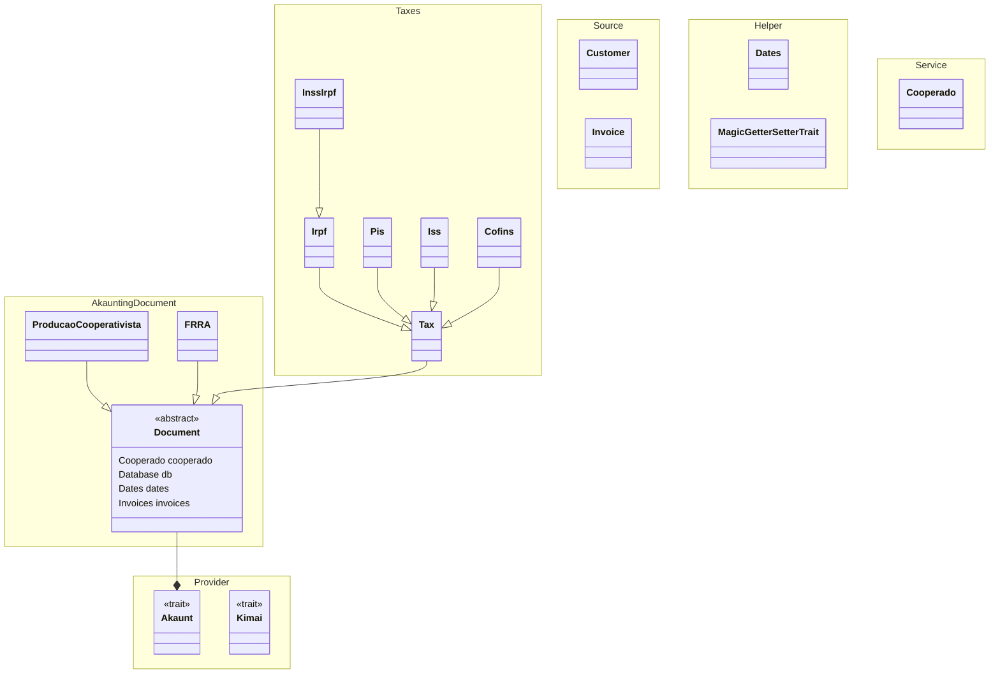

```mermaid
classDiagram
    namespace AkauntingDocument {
        class Document {
            <<abstract>>
            Cooperado cooperado
            Database db
            Dates dates
            Invoices invoices
        }
        class FRRA
        class ProducaoCooperativista
    }

    namespace Taxes {
        class Tax
        class Irpf
        class InssIrpf
        class Pis
        class Iss
        class Cofins
    }

    namespace Source {
        class Customer
        class Invoice
        %% class Nfse
        %% class Project
        %% class Timesheet
        %% class Transaction
        %% class User
    }

    namespace Provider {
        class Akaunt {
            <<trait>>
        }
        class Kimai {
            <<trait>>
        }
    }

    namespace Helper {
        class Dates
        class MagicGetterSetterTrait
    }

    namespace Service {
        class Cooperado
    }

    Document --* Akaunt

    ProducaoCooperativista --|> Document

    FRRA --|> Document

    Tax --|> Document
    Irpf --|> Tax
    InssIrpf --|> Irpf
    Pis --|> Tax
    Iss --|> Tax
    Cofins --|> Tax
```