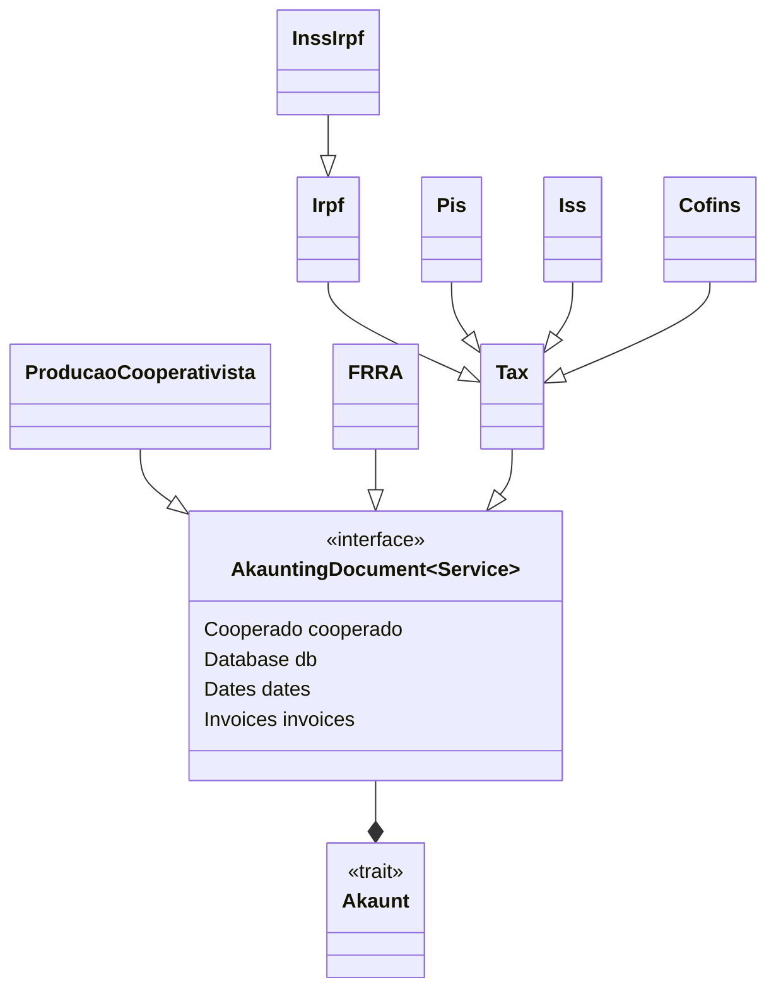

```mermaid
classDiagram
    class AkauntingDocument~Service~ {
        Cooperado cooperado
        Database db
        Dates dates
        Invoices invoices
    }
    <<interface>> AkauntingDocument

    class Akaunt
    <<trait>> Akaunt

    AkauntingDocument --* Akaunt

    ProducaoCooperativista --|> AkauntingDocument

    FRRA --|> AkauntingDocument

    Tax --|> AkauntingDocument
    Irpf --|> Tax
    InssIrpf --|> Irpf
    Pis --|> Tax
    Iss --|> Tax
    Cofins --|> Tax
```